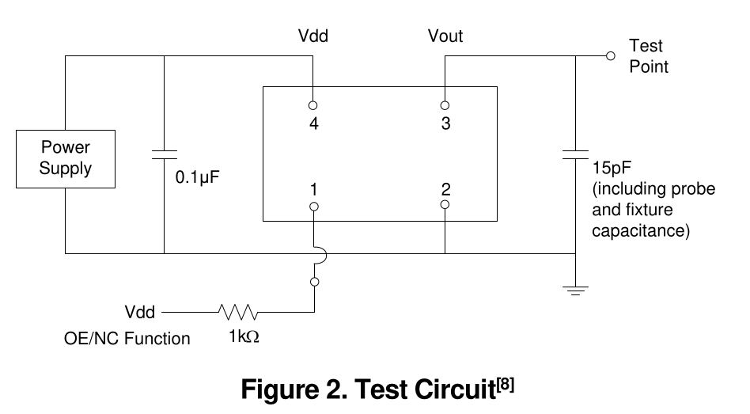

## Test Circuit and Waveform

**Figure 2. Test Circuit[8]**

**Figure 3. Waveform**

> Note for Figure 2 y 3
  [8] Duty Cycle is computed as Duty Cycle = TH/Period.

## Timing Diagrams

**Figure 4. Startup Timing (OE/ ST Mode)[9]**

> Note for Figure 4. Startup Timing (OE/ ST Mode):
  [9] SiT8924 has “no runt” pulses and “no glitch” output during startup or resume.

**Figure 5. Standby Resume Timing ( ST Mode Only)**

**Figure 6. OE Enable Timing (OE Mode Only)**

**Figure 7. OE Disable Timing (OE Mode Only)**

## Tables related with figures below 

## Features

- AEC-Q100 with extended temperature range (-55°C to 125°C)
- Frequencies between 1 MHz and 110 MHz accurate to 6 decimal places
- Supply voltage of 1.8 V or 2.25 V to 3.63 V
- Excellent total frequency stability as low as ±20 ppm
- Industry best G-sensitivity of 0.1 PPB/G
- Low power consumption of 3.8 mA typical at 1.8 V
- Standby mode for longer battery life
- LVCMOS/LVTTL compatible output
- Industry-standard packages: 2.0 x 1.6, 2.5 x 2.0, 3.2 x 2.5, 5.0 x 3.2, 7.0 x 5.0 mm x mm
- RoHS and REACH compliant, Pb-free, Halogen-free and Antimony-free

## Applications

- Automotive, extreme temperature and other high-rel electronics
- Infotainment systems, collision detection devices, and in-vehicle networking
- Powertrain control

Related products for automotive applications .

For aerospace and defense applications SiTime recommends using only Endura™ SiT8944 . 

## Electrical Characteristics

## Table 1. Electrical Characteristics [1,2]

All Min and Max limits are specified over temperature and rated operating voltage with 15 pF output load unless otherwise sta ted. Typical values are at 25°C and nominal supply voltage.

| Parameter | Parameters | Symbol | Min. | Typ. | Max. | Unit | Condition |
|------------|------------|--------|------|------|------|------|-----------|
| Frequency Range| Output Frequency Range | f | 1 | - | 110 | MHz | Refer to Table 13 to 15 for a list supported frequencies |
| Frequency Stability andAging | FrequencyStability | F_stab | -20 | - | +20 | ppm | Inclusive of Initial tolerance at 25°C, 1st year aging at 25°C, and variations over operating temperature, rated power supply voltage and load (15 pF ± 10%) |
| Frequency Stability andAging | FrequencyStability | F_stab | -25 | - | +25 | ppm | Inclusive of Initial tolerance at 25°C, 1st year aging at 25°C, and variations over operating temperature, rated power supply voltage and load (15 pF ± 10%) |
| Frequency Stability andAging | FrequencyStability | F_stab | -30 | - | +30 | ppm | Inclusive of Initial tolerance at 25°C, 1st year aging at 25°C, and variations over operating temperature, rated power supply voltage and load (15 pF ± 10%) |
| Frequency Stability andAging | FrequencyStability | F_stab | -50 | - | +50 | ppm | Inclusive of Initial tolerance at 25°C, 1st year aging at 25°C, and variations over operating temperature, rated power supply voltage and load (15 pF ± 10%) |
| Operating TemperatureRange | Operating Temperature Range (ambient)  | T_use | -40 | - | +85 | °C | AEC-Q100 Grade3 |
| Operating TemperatureRange | Operating Temperature Range (ambient)  | T_use | -40 | - | +105 | °C | AEC-Q100 Grade2 |
| Operating TemperatureRange | Operating Temperature Range (ambient)  | T_use | -40 | - | +125 | °C | AEC-Q100 Grade1 |
| Operating TemperatureRange | Operating Temperature Range (ambient)  | T_use | -55 | - | +125 | °C | Extendedcold AEC-Q100 Grade1 |
| Supply Voltage and Current Consumption | Supply Voltage | Vdd | 1.62 | 1.8 | 1.98 | V | All voltages between 2.25 V and 3.63 V including 2.5 V, 2.8 V, 3.0 V and 3.3 V are supported |
| Supply Voltage and Current Consumption | Supply Voltage | Vdd | 2.25 | - | 3.63 | V | All voltages between 2.25 V and 3.63 V including 2.5 V, 2.8 V, 3.0 V and 3.3 V are supported |
| Supply Voltage and Current Consumption | Current Consumption | Idd | - | 4.0 | 4.8 | mA | No load condition, f = 20 MHz, Vdd = 2.25 V to3.63 V |
| Supply Voltage and Current Consumption | Current Consumption | Idd | - | 3.8 | 4.5 | mA | No load condition, f = 20 MHz, Vdd =1.8 V |
| Supply Voltage and Current Consumption | OE Disable Current | I_od | - | - | 4.5 | mA | Vdd = 2.5 V to 3.3 V, OE = Low, Output in high Zstate |
| Supply Voltage and Current Consumption | OE Disable Current | I_od | - | - | 4.3 | mA | Vdd = 1.8 V, OE = Low, Output in high Zstate |
| Supply Voltage and Current Consumption | Standby Current | I_std | - | 2.6 | - | uA | Vdd = 2.8 V to 3.3V, ST = Low, Output is weakly pulleddown |
| Supply Voltage and Current Consumption | Standby Current | I_std | - | 1.4 | - | uA | Vdd = 2.5 V, ST = Low, Output is weakly pulleddown |
| Supply Voltage and Current Consumption | Standby Current | I_std | - | 0.6 | - | uA | Vdd = 1.8 V, ST = Low, Output is weakly pulleddown |
| LVCMOS OutputCharacteristics | Duty Cycle | DC | 45 | - | 55 | % | All Vdd levels |
| LVCMOS OutputCharacteristics | Rise/FallTime | Tr, Tf | - | 1.5 | 3 | ns | Vdd = 2.25 V - 3.63 V, 20% - 80% |
| LVCMOS OutputCharacteristics | Rise/FallTime | Tr, Tf | - | 1.3 | 2.5 | ns | Vdd = 1.8 V, 20% - 80% |
| LVCMOS OutputCharacteristics | Output High Voltage | VOH | 90% | - | - | Vdd | IOH = -4 mA (Vdd = 3.0 V or 3.3 V) IOH = -3 mA (Vdd = 2.8 V and Vdd =2.5 V) IOH = -2 mA (Vdd = 1.8 V) |
| LVCMOS OutputCharacteristics | Output Low Voltage | VOL | - | - | 10% | Vdd | IOL = 4 mA (Vdd = 3.0 V or 3.3 V) IOL = 3 mA (Vdd = 2.8 V and Vdd =2.5 V) IOL = 2 mA (Vdd = 1.8 V) |
| Input Characteristics | Input Characteristics    | Input Characteristics    | Input Characteristics    | Input Characteristics    | Input Characteristics    | Input Characteristics |
| Input Characteristics | Input High Voltage | VIH | 70% | - | - | Vdd | Pin 1, OE or ST |
| Input Characteristics | Input Low Voltage | VIL | - | - | 30% | Vdd | Pin 1, OE or ST |
| Input Characteristics | Input Pull-up Impedance   | Z_in | - | 100 | - | k Ω | Pin 1, OE logic high or logic low, or ST logic high |
| Input Characteristics | Input Pull-up Impedance |   Z_in | 2 | - | - | M Ω | Pin 1, ST logic low |
| Startup and ResumeTiming  | StartupTime | T_start | - | - | 5.5 | ms | Measured from the time Vdd reaches its rated minimum value |
| Startup and ResumeTiming  | Enable/DisableTime | T_oe | - | - | 130 | ns | f = 110 MHz. For other frequencies, T_oe = 100 ns + 3 * cycles |
| Startup and ResumeTiming  | Resume Time | T_resume | - | - | 5 | ms | Measured from the time ST pin crosses 50%threshold |
| Jitter | RMS Period Jitter | T_jitt | - | 1.6 | 2.5 | ps | f = 75 MHz, 2.25 V to 3.63 V |
| Jitter | RMS Period Jitter         | T_jitt | - | 1.9 | 3.0 | ps | f = 75 MHz, 1.8 V |
| Jitter | RMS Phase Jitter (random) | T_phj | - | 0.5 | - | ps | f = 75 MHz, Integration bandwidth = 900 kHz to 7.5 MHz |
| Jitter | RMS Phase Jitter (random) | T_phj | - | 1.3 | - | ps | f = 75 MHz, Integration bandwidth = 12 kHz to 20 MHz |

> Notes for Table 1. Electrical Characteristics:
    [1]  All electrical specifications in the above table are specified with 15 pF output load and for all Vdd(s) unless otherwise stated.
    [2]  The typical value of any parameter in the Electrical Characteristic table is specified for the nominal value of the highest voltage option for that parameter and at 25°C temperature.

## Table 2. Pin Description

|   Pin | Symbol     | Functionality   | Functionality                                                                                                                     |
|-------|------------|-----------------|-----------------------------------------------------------------------------------------------------------------------------------|
|     1 | OE/ ST /NC | Output Enable   | H [3] : specified frequency output. L: output is high impedance. Only output driver is disabled.                                   |
|     1 | OE/ ST /NC | Standby         | H [3] : specified frequency output. L: output is low (weak pull down). Device goes to sleep mode. Supply current reduces to I_std. |
|     1 | OE/ ST /NC | No Connect      | Any voltage between 0 and Vdd or Open [3] : Specified frequency output. Pin 1 has no function.                                    |
|     2 | GND        | Power           | Electrical ground [4]                                                                                                             |
|     3 | OUT        | Output          | Oscillator output                                                                                                                 |
|     4 | VDD        | Power           | Power supply voltage [4]                                                                                                          |

> Notes for Table 2. Pin Description:
    [3]  In OE or  ST mode, a pull-up resistor of 10 kΩ or less is recommended if pin 1 is not externally driven. If pin 1 needs to be left floating, use the NC option.
    [4]  A capacitor of value 0.1 µF or higher between Vdd and GND is required.

