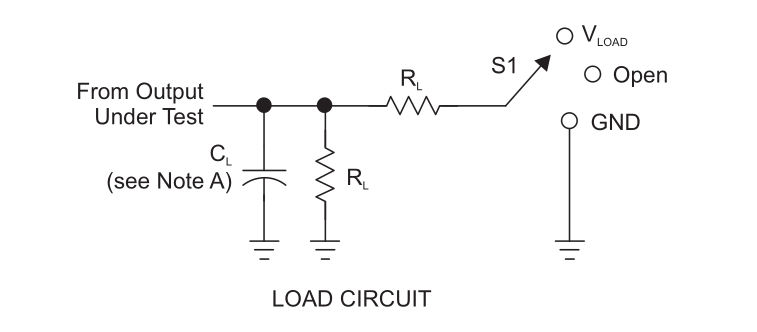
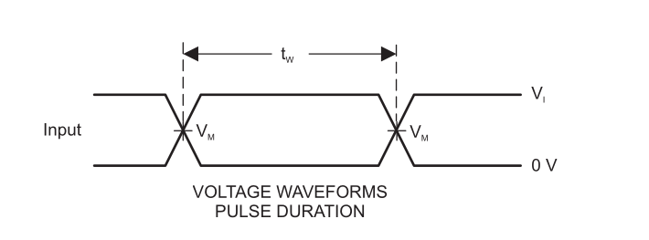
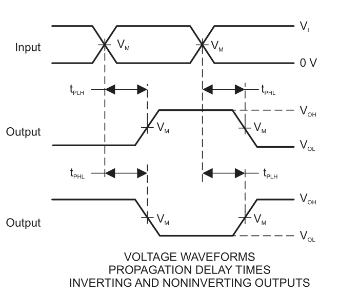
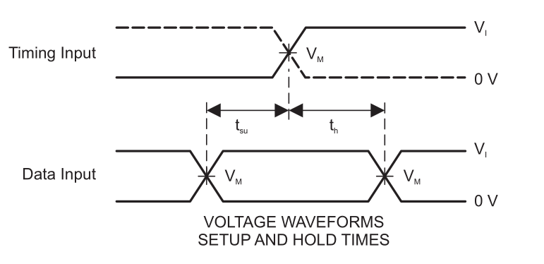
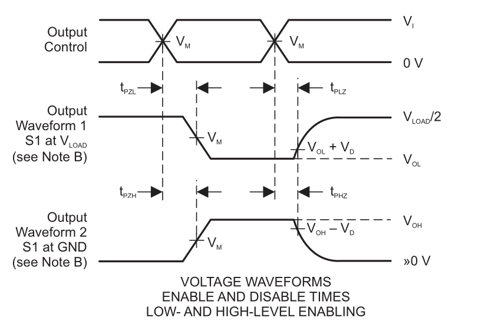

# Tables for contex for figure 6.0.png

Tables below are part of context of Figure 6.0 Those contain information that join with file will helpful to create an AI oriented information.

**Figure 6.0 LOAD CIRCUIT**

| TEST        | S1     |
|-------------|--------|
| tPLH / tPHL | Open   |
| tPLZ / tPZL | V LOAD |
| tPHZ / tPZH | GND    |

|  VCC           | VI INPUTS   | tr / tf INPUTS |  VM | VLOAD | CL |  RL | VD |
|----------------|-------------|----------------|-----|-------|----|-----|----|
| 1.8 V ± 0.15 V | VCC     | ≤2 ns    | V CC /2 | 2 × VCC | 15 pF | 1 MΩ | 0.15 V |
| 2.5 V ± 0.2 V  | VCC     | ≤2 ns    | V CC /2 | 2 × VCC | 15 pF | 1 MΩ | 0.15 V |
| 3.3 V ± 0.3 V  | 3V      | ≤2.5 ns  | 1.5 V   | 6V      | 15 pF | 1 MΩ | 0.3 V  |
| 5 V ± 0.5 V    | VCC     | ≤2.5 ns  | V CC /2 | 2 × VCC | 15 pF | 1 MΩ | 0.3 V  |

# Tables for contex for figure 6.1.png

Tables below are part of context of Figures 6.1 Those contain information that join with file  will helpful to create an AI oriented information.

**Figure 6.1-a VOLTAGE WAVEFORMS PULSE DURATION**

**Figure 6.1-b VOLTAGE WAVEFORMS PROPAGATION DELAY TIMES INVERTING AND NONINVERTING OUTPUTS**

**Figure 6.1-c VOLTAGE WAVEFORMS SETUP AND HOLD TIMES**

**Figure 6.1-d VOLTAGE WAVEFORMS ENABLE AND DISABLE TIMES LOW- AND HIGH-LEVEL ENABLING**

## 5.6 Timing Requirements: TA = -40°C to +85°C

over recommended operating free-air temperature range, TA = -40°C to +85°C (unless otherwise noted) (see Figures 6.1-a to 6.1-d)

**Table 5.6**

|         |                                 | VCC                |   MIN |   MAX | UNIT   |
|---------|---------------------------------|---------------------|-------|-------|--------|
| fclock | Clock frequency                 | VCC = 1.8V ± 0.15V |       |   160 | MHz    |
| fclock | Clock frequency                 | VCC = 2.5V ± 0.2V  |       |   160 | MHz    |
| fclock | Clock frequency                 | VCC = 3.3V ± 0.3V  |       |   160 | MHz    |
| fclock | Clock frequency                 | VCC = 5.5V ± 0.5V  |       |   160 | MHz    |
| tw     | Pulse duration, CLK high or low | VCC = 1.8V ± 0.15V |   2.5 |       | ns     |
| tw     | Pulse duration, CLK high or low | VCC = 2.5V ± 0.2V  |   2.5 |       | ns     |
| tw     | Pulse duration, CLK high or low | VCC = 3.3V ± 0.3V  |   2.5 |       | ns     |
| tw     | Pulse duration, CLK high or low | VCC = 5.5V ± 0.5V  |   2.5 |       | ns     |
| tsu    | Setup time before CLK↑ , Data high | VCC = 1.8V ± 0.15V |   2.3 |       | ns     |
| tsu    | Setup time before CLK↑ , Data high | VCC = 2.5V ± 0.2V  |   1.5 |       | ns     |
| tsu    | Setup time before CLK↑ , Data high | VCC = 3.3V ± 0.3V  |   1.3 |       | ns     |
| tsu    | Setup time before CLK↑ , Data high | VCC = 5.5V ± 0.5V  |   1.1 |       | ns     |
| tsu    | Setup time before CLK↑ , Data low | VCC = 1.8V ± 0.15V |   2.5 |       | ns     |
| tsu    | Setup time before CLK↑ , Data low | VCC = 2.5V ± 0.2V  |   1.5 |       | ns     |
| tsu    | Setup time before CLK↑ , Data low | VCC = 3.3V ± 0.3V  |   1.3 |       | ns     |
| tsu    | Setup time before CLK↑ , Data low | VCC = 5.5V ± 0.5V  |   1.1 |       | ns     |
| th     | Hold time, data after CLK↑       | VCC = 1.8V ± 0.15V |     0 |       | ns     |
| th     | Hold time, data after CLK↑       | VCC = 2.5V ± 0.2V  |   0.2 |       | ns     |
| th     | Hold time, data after CLK↑       | VCC = 3.3V ± 0.3V  |   0.9 |       | ns     |
| th     | Hold time, data after CLK↑       | VCC = 5.5V ± 0.5V  |   0.4 |       | ns     |

## 5.7 Timing Requirements: TA = -40°C to +125°C

over recommended operating free-air temperature range, TA = -40°C to +125°C (unless otherwise noted) (see Figures 6.1-a to 6.1-d)

**Table 5.7**

|                    |           | V CC                |   MIN |   MAX | UNIT   |
|--------------------|-----------|---------------------|-------|-------|--------|
| fclock             | Clock frequency | VCC = 1.8V ± 0.15V |       |   160 | MHz    |
| fclock             | Clock frequency | VCC = 2.5V ± 0.2V  |       |   160 | MHz    |
| fclock             | Clock frequency | VCC = 3.3V ± 0.3V  |       |   160 | MHz    |
| fclock             | Clock frequency | VCC = 5.5V ± 0.5V  |       |   160 | MHz    |
| tw | Pulse duration, CLK high or low | VCC = 1.8V ± 0.15V |   2.5 |       | ns     |
| tw | Pulse duration, CLK high or low | VCC = 2.5V ± 0.2V  |   2.5 |       | ns     |
| tw | Pulse duration, CLK high or low | VCC = 3.3V ± 0.3V  |   2.5 |       | ns     |
| tw | Pulse duration, CLK high or low | VCC = 5.5V ± 0.5V  |   2.5 |       | ns     |
| tsu | Setup time before CLK↑ , Data high | VCC = 1.8V ± 0.15V |   2.3 |       | ns     |
| tsu | Setup time before CLK↑ , Data high | VCC = 2.5V ± 0.2V  |   1.5 |       | ns     |
| tsu | Setup time before CLK↑ , Data high | VCC = 3.3V ± 0.3V  |   1.3 |       | ns     |
| tsu | Setup time before CLK↑ , Data high | VCC = 5.5V ± 0.5V  |   1.1 |       | ns     |
| tsu | Setup time before CLK↑ , Data low | VCC = 1.8V ± 0.15V |   2.5 |       | ns     |
| tsu | Setup time before CLK↑ , Data low | VCC = 2.5V ± 0.2V  |   1.5 |       | ns     |
| tsu | Setup time before CLK↑ , Data low | VCC = 3.3V ± 0.3V  |   1.3 |       | ns     |
| tsu | Setup time before CLK↑ , Data low | VCC = 5.5V ± 0.5V  |   1.1 |       | ns     |
| th | Hold time, data after CLK↑| VCC = 1.8V ± 0.15V |     0 |       | ns     |
| th | Hold time, data after CLK↑| VCC = 2.5V ± 0.2V  |   0.2 |       | ns     |
| th | Hold time, data after CLK↑| VCC = 3.3V ± 0.3V  |   0.9 |       | ns     |
| th | Hold time, data after CLK↑| VCC = 5.5V ± 0.5V  |   0.4 |       | ns     |

## 5.8 Switching Characteristics: TA = -40°C to +85°C, CL = 15pF

over recommended operating free-air temperature range, TA = -40°C to +85°C, CL = 15pF (unless otherwise noted) (see Figures 6.1-a to 6.1-d)

**Table 5.8**

| PARAMETER  | FROM (INPUT)   | TO (OUTPUT)   | VCC               |   MIN |   MAX | UNIT   |
|------------|----------------|---------------|--------------------|-------|-------|--------|
| fmax       |                |               | VCC = 1.8V ± 0.15V |   160 |       | MHz    |
| fmax       |                |               | VCC = 2.5V ± 0.2V  |   160 |       | MHz    |
| fmax       |                |               | VCC = 3.3V ± 0.3V  |   160 |       | MHz    |
| fmax       |                |               | VCC = 5V ± 0.5V    |   160 |       | MHz    |
| tpd        | CLK            | Q             | VCC = 1.8V ± 0.15V |     3 |   9.1 | ns     |
| tpd        | CLK            | Q             | VCC = 2.5V ± 0.2V  |   1.5 |     6 | ns     |
| tpd        | CLK            | Q             | VCC = 3.3V ± 0.3V  |   1.3 |   4.2 | ns     |
| tpd        | CLK            | Q             | VCC = 5V ± 0.5V    |   1.1 |   3.8 | ns     |

> NOTES for figures 6.1-a to 6.1-d: 
    - CL includes probe and jig capacitance. 
    - Waveform 1 is for an output with internal conditions such that the output is low, except when disabled by the output control. Waveform 2 is for an output with internal conditions such that the output is high, except when disabled by the output control.
    - All input pulses are supplied by generators having the following characteristics: PRR £ 10 MHz, Z = 50 W. O
    - The outputs are measured one at a time, with one transition per measurement.
    - tPLZ and tPHZ are the same as tdis
    - tPZL and tPZH are the same as ten
    - tPLH and tPHL are the same as tpd   
    - All parameters and waveforms are not applicable to all devices.

