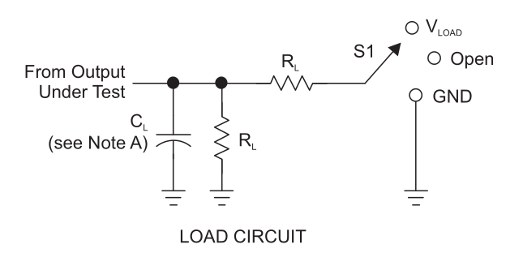
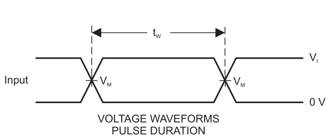
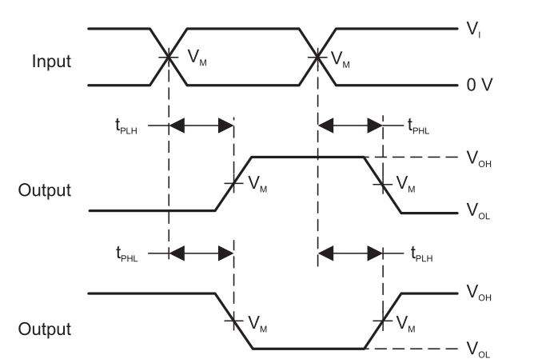
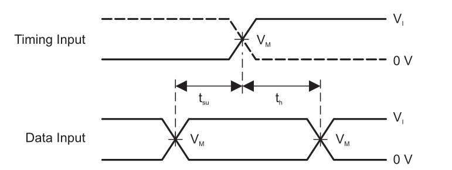
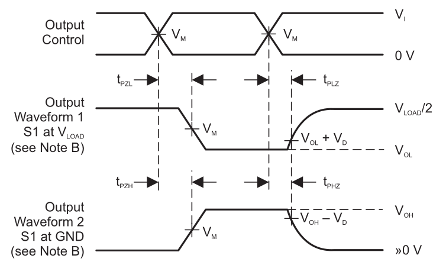

# Tables for contex for figure 6.2.png

Tables below are part of context of Figure 6.2 "LOAD CIRCUIT" Those contain information that join with file will helpful to create an AI oriented information.

**Figure 6.2 LOAD CIRCUIT**

| TEST        | S1     |
|-------------|--------|
| tPLH / tPHL | Open   |
| tPLZ / tPZL | VLOAD |
| tPHZ / tPZH | GND    |

|  VCC           | VI INPUT   | tr / tf INPUT |  VM | VLOAD | CL |  RL | VD |
|----------------|----------|----------|---------|----------|-------|------|--------|
| 1.8 V ± 0.15 V | VCC     | ≤2 ns    | VCC /2 | 2 × VCC | 30 pF | 1 kΩ | 0.15 V |
| 2.5 V ± 0.2 V  | VCC     | ≤2 ns    | VCC /2 | 2 × VCC | 30 pF | 500 Ω | 0.15 V |
| 3.3 V ± 0.3 V  | 3V      | ≤2.5 ns  | 1.5 V   | 6V      | 50 pF | 500 Ω | 0.3 V  |
| 5 V ± 0.5 V    | VCC     | ≤2.5 ns  | VCC /2 | 2 × VCC | 50 pF | 500 Ω | 0.3 V  |

# Tables for contex for figure 6.2.png

Tables below are part of context of Figures 6.2 Those contain information that join with file  will helpful to create an AI oriented information.

**Figure 6.2-a VOLTAGE WAVEFORMS PULSE DURATION**

**Figure 6.2-b VOLTAGE WAVEFORMS PROPAGATION DELAY TIMES INVERTING AND NONINVERTING OUTPUTS**

**Figure 6.2-c VOLTAGE WAVEFORMS SETUP AND HOLD TIMES**

**Figure 6.2-d VOLTAGE WAVEFORMS ENABLE AND DISABLE TIMES LOW- AND HIGH-LEVEL ENABLING**

## 5.9 Switching Characteristics: TA = -40°C to +85°C, CL = 30pF or 50pF

over recommended operating free-air temperature range, TA = -40°C to +85°C, CL = 30pF or 50pF (unless otherwise noted) (see Figures 6.2-a to 6.2-d)

**Table 5.9**

| PARAMETER   | FROM (INPUT)   | TO (OUTPUT)  | VCC                |   MIN | MAX   | UNIT   |
|-------------|----------------|--------------|--------------------|-------|-------|--------|
| fmax       |                |               | VCC = 1.8V ± 0.15V |   160 |       | MHz    |
| fmax       |                |               | VCC = 2.5V ± 0.2V  |   160 |       | MHz    |
| fmax       |                |               | VCC = 5V ± 0.5V    |   160 |       | MHz    |
| fmax       |                |               | VCC = 5V ± 0.5V    |   160 |       | MHz    |
| tpd        | CLK            | Q             | VCC = 1.8V ± 0.15V |   4.4 |   9.9 | ns     |
| tpd        | CLK            | Q             | VCC = 2.5V ± 0.2V  |   2.3 |     7 | ns     |
| tpd        | CLK            | Q             | VCC = 3.3V ± 0.3V  |     2 |   5.2 | ns     |
| tpd        | CLK            | Q             | VCC = 5V ± 0.5V    |   1.3 |   4.5 | ns     |

## 5.10 Switching Characteristics: TA = -40°C to +125°C, CL = 30pF or 50pF

over recommended operating free-air temperature range, TA = -40°C to +125°C, CL = 30pF or 50pF (unless otherwise noted) (see Figures 6.2-a to 6.2-d)

**Table 5.10**

| PARAMETER  | FROM (INPUT)   | TO (OUTPUT)  | VCC                |   MIN |   MAX | UNIT   |
|------------|----------------|--------------|--------------------|-------|-------|--------|
| fmax       |                |               | VCC = 1.8V ± 0.15V |   160 |       | MHz    |
| fmax       |                |               | VCC = 2.5V ± 0.2V  |   160 |       | MHz    |
| fmax       |                |               | VCC = 3.3V ± 0.3V  |   160 |       | MHz    |
| fmax       |                |               | VCC = 5V ± 0.5V    |   160 |       | MHz    |
| tpd        | CLK            | Q             | VCC = 1.8V ± 0.15V |   4.4 |  12.5 | ns     |
| tpd        | CLK            | Q             | VCC = 2.5V ± 0.2V  |   2.3 |   8.5 | ns     |
| tpd        | CLK            | Q             | VCC = 3.3V ± 0.3V  |     2 |     6 | ns     |
| tpd        | CLK            | Q             | VCC = 5V ± 0.5V    |   1.3 |   5.5 | ns     |

> NOTES for figures 6.2-a to 6.2-d: 
    - CL includes probe and jig capacitance.
    - Waveform 1 is for an output with internal conditions such that the output is low, except when disabled by the output control. Waveform 2 is for an output with internal conditions such that the output is high, except when disabled by the output control.
    - All input pulses are supplied by generators having the following characteristics: PRR £ 10 MHz, Z = 50 W. O
    - The outputs are measured one at a time, with one transition per measurement.
    - tPLZ and tPHZ are the same as tdis .   
    - tPZL and tPZH are the same as ten .   
    - tPLH and tPHL are the same as tpd .   
    - All parameters and waveforms are not applicable to all devices.
